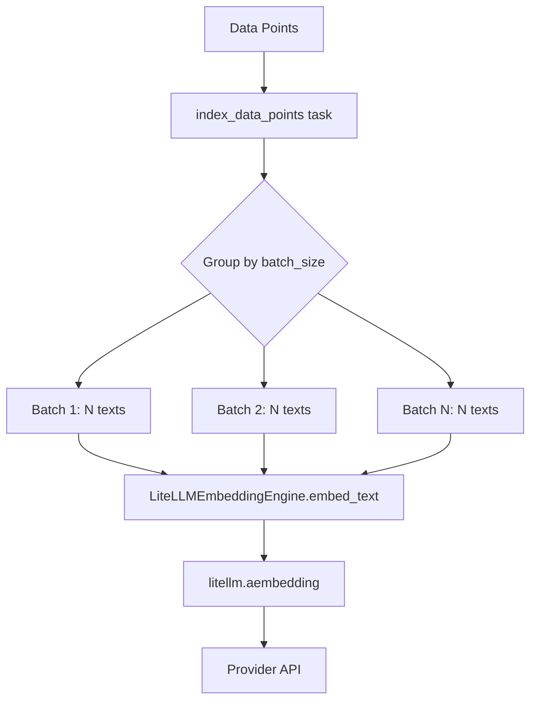
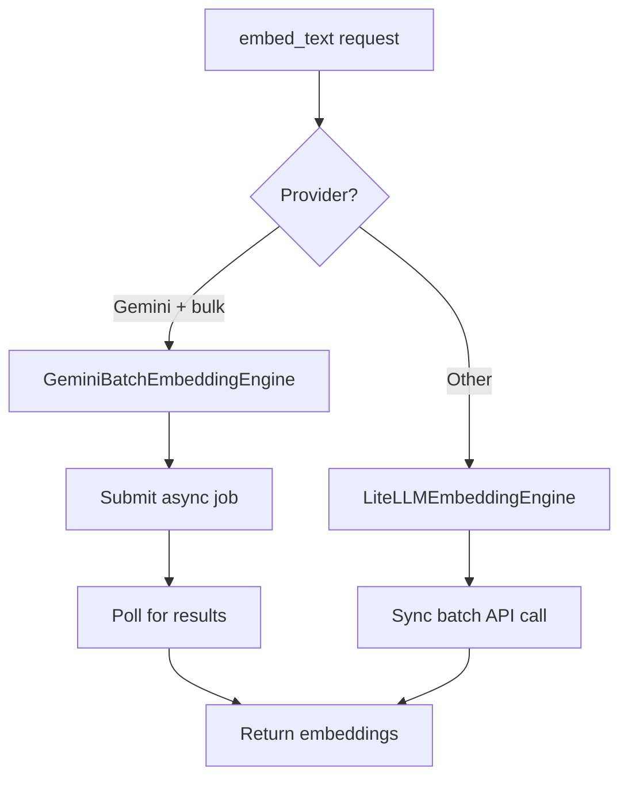
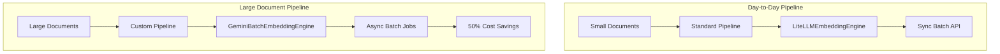

# Batch Embeddings Feasibility Analysis

## Executive Summary

**Status: Partially Feasible with Caveats**

The feasibility depends on which type of "batch embeddings" is desired:

| Type | Current Support | Feasibility | Effort |
|------|-----------------|-------------|--------|
| Synchronous batch (multiple texts per API call) | ✅ Already implemented | N/A | N/A |
| Asynchronous batch jobs (Gemini Batch API) | ❌ Not supported | Medium-High | Moderate |

---

## Current Architecture Analysis

### How Cognee Handles Embeddings Today



### Key Components

1. **[`LiteLLMEmbeddingEngine`](cognee/infrastructure/databases/vector/embeddings/LiteLLMEmbeddingEngine.py)** - Main embedding engine
   - Uses `litellm.aembedding()` for async calls
   - Already accepts `List[str]` input (synchronous batching)
   - Configurable `batch_size` parameter (default: 36)

2. **[`EmbeddingConfig`](cognee/infrastructure/databases/vector/embeddings/config.py)** - Configuration
   - `embedding_batch_size`: Controls how many texts per API call
   - Provider-agnostic configuration

3. **[`index_data_points`](cognee/tasks/storage/index_data_points.py)** - Task that batches data
   - Groups data points by type and field
   - Creates async tasks for each batch
   - Uses `asyncio.gather()` for parallel processing

### Current Batching Behavior

```python
# From LiteLLMEmbeddingEngine.embed_text()
response = await litellm.aembedding(
    model=self.model,
    input=non_empty_text,  # List of strings - already batched!
    api_key=self.api_key,
    api_base=self.endpoint,
)
```

**Cognee already sends multiple texts per API call** - this is synchronous batching.

---

## Gemini Batch Embeddings API Analysis

### What Gemini Offers

The Gemini Batch API is an **asynchronous job-based system**:

```python
# Gemini Batch API example
from google import genai

client = genai.Client()

# Create batch job with inline requests
batch_job = client.batches.create_embeddings(
    model="gemini-embedding-001",
    src={'inlined_requests': inlined_requests},
    config={'display_name': "Inlined embeddings batch"},
)
```

### Key Differences

| Feature | Current (Sync Batch) | Gemini Batch API |
|---------|---------------------|------------------|
| Processing | Immediate | Asynchronous job |
| Cost | Standard | 50% lower |
| Latency | Low (real-time) | High (job queue) |
| Use case | Interactive/real-time | Bulk processing |
| Result retrieval | Immediate return | Poll for completion |
| Job management | None | Create/monitor/cancel jobs |

### LiteLLM Support Status

**LiteLLM does NOT currently support Gemini's batch embeddings API.**

Evidence:
- LiteLLM has `batch_completion()` for LLM completions
- LiteLLM has Vertex Batch API support for file-based operations
- No `batch_embedding()` or `aembedding_batch()` function exists
- [GitHub Issue #4241](https://github.com/BerriAI/litellm/issues/4241) requests configurable batch sizes
- [GitHub Issue #18000](https://github.com/BerriAI/litellm/issues/18000) mentions GoogleBatchEmbeddings but indicates bugs

---

## Implementation Options

### Option 1: Direct Gemini SDK Integration (Recommended for Gemini users)

Add a dedicated `GeminiBatchEmbeddingEngine` that uses the Google GenAI SDK directly.

**Pros:**
- Full access to Gemini Batch API features
- 50% cost reduction for bulk operations
- No LiteLLM dependency for this path

**Cons:**
- Gemini-specific implementation
- Requires job state management
- Not portable to other providers

**Implementation sketch:**

```python
class GeminiBatchEmbeddingEngine(EmbeddingEngine):
    async def embed_text(self, text: List[str]) -> List[List[float]]:
        # Submit batch job
        batch_job = await self.client.batches.create_embeddings(
            model=self.model,
            src={'inlined_requests': [{'content': t} for t in text]},
        )
        
        # Poll for completion
        while batch_job.state not in ['COMPLETED', 'FAILED']:
            await asyncio.sleep(10)
            batch_job = await self.client.batches.get(batch_job.id)
        
        # Retrieve results
        results = await self.client.batches.get_results(batch_job.id)
        return [r['embedding'] for r in results]
```

### Option 2: Wait for LiteLLM Support

Monitor LiteLLM for batch embeddings support and integrate when available.

**Pros:**
- Maintains provider-agnostic approach
- Less maintenance burden

**Cons:**
- Unknown timeline
- May not support all providers equally

### Option 3: Hybrid Approach (Best of both worlds)

Implement provider-specific batch engines while maintaining the current sync approach as default.



---

## Recommended Approach

### Phase 1: Configuration Enhancement

1. Add `embedding_mode` configuration option:
   - `sync` (default): Current behavior
   - `batch_async`: Use async batch jobs where supported

2. Add provider-specific batch size limits:
   ```python
   BATCH_SIZE_LIMITS = {
       "openai": 2048,  # OpenAI limit
       "gemini": 100,   # Per batch job
       "anthropic": 100,
   }
   ```

### Phase 2: Gemini Batch Engine

1. Create `GeminiBatchEmbeddingEngine` class
2. Implement job submission, polling, and result retrieval
3. Add error handling for failed jobs
4. Implement job cancellation on shutdown

### Phase 3: Integration

1. Update `get_embedding_engine()` to select appropriate engine
2. Add configuration documentation
3. Add tests for batch embedding workflows

---

## Risk Assessment

| Risk | Likelihood | Impact | Mitigation |
|------|------------|--------|------------|
| LiteLLM adds conflicting API | Medium | Low | Use direct SDK for batch |
| Gemini API changes | Low | Medium | Abstract behind interface |
| Job timeout/failures | Medium | High | Implement retry + fallback |
| Cost overruns from polling | Low | Medium | Configurable poll intervals |

---

## Conclusion

**Feasibility: MEDIUM-HIGH**

The current architecture already supports synchronous batching (multiple texts per API call). Implementing Gemini-style asynchronous batch jobs is feasible but requires:

1. **New engine class** - `GeminiBatchEmbeddingEngine` using Google's SDK directly
2. **Job management** - State tracking, polling, error handling
3. **Configuration** - Mode selection between sync and async batch

**Recommendation:** Proceed with Option 3 (Hybrid Approach) if:
- Bulk processing cost savings are important
- Latency is acceptable for your use case
- You primarily use Gemini embeddings

Otherwise, the current synchronous batching is sufficient for most real-time use cases.

---

## Custom Pipeline for Large Documents

### Architecture Analysis

Cognee supports custom pipelines via [`run_custom_pipeline()`](cognee/modules/run_custom_pipeline/run_custom_pipeline.py):

```python
from cognee.modules.run_custom_pipeline import run_custom_pipeline
from cognee.modules.pipelines.tasks.task import Task

# Define custom tasks
tasks = [
    Task(extract_chunk, task_config={"batch_size": 100}),
    Task(index_data_points, task_config={"batch_size": 100}),
]

# Run custom pipeline
await run_custom_pipeline(
    tasks=tasks,
    data=large_document_data,
    dataset="large_docs",
    run_in_background=True,  # Recommended for large datasets
)
```

### Challenge: Embedding Engine is a Singleton

The current architecture has a constraint - the embedding engine is created as a singleton via `@lru_cache` in [`get_embedding_engine.py`](cognee/infrastructure/databases/vector/embeddings/get_embedding_engine.py):

```python
@lru_cache
def create_embedding_engine(...):
    # Returns cached instance based on config
```

This means **all pipelines share the same embedding engine configuration**.

### Solution: Custom Embedding Engine Injection

To support different embedding modes for different pipelines, we need to:

1. **Add embedding engine parameter to tasks** - Allow tasks to accept a custom embedding engine
2. **Create a GeminiBatchEmbeddingEngine** - For async batch processing
3. **Modify index_data_points task** - To use injected embedding engine



### Implementation Plan for Custom Pipeline

#### Phase 1: Create GeminiBatchEmbeddingEngine

```python
# cognee/infrastructure/databases/vector/embeddings/GeminiBatchEmbeddingEngine.py

class GeminiBatchEmbeddingEngine(EmbeddingEngine):
    """Embedding engine using Gemini Batch API for cost-effective bulk processing."""
    
    def __init__(self, model: str = "gemini-embedding-001", ...):
        from google import genai
        self.client = genai.Client()
        self.model = model
        self.poll_interval = 10  # seconds
        
    async def embed_text(self, text: List[str]) -> List[List[float]]:
        # Submit batch job
        batch_job = await self._create_batch_job(text)
        
        # Poll for completion
        while batch_job.state not in ['COMPLETED', 'FAILED']:
            await asyncio.sleep(self.poll_interval)
            batch_job = await self.client.batches.get(batch_job.id)
        
        if batch_job.state == 'FAILED':
            raise EmbeddingException(f"Batch job failed: {batch_job.error}")
        
        # Retrieve and return results
        return await self._get_batch_results(batch_job)
```

#### Phase 2: Add Embedding Engine Parameter to Tasks

Modify [`index_data_points`](cognee/tasks/storage/index_data_points.py) to accept optional embedding engine:

```python
async def index_data_points(
    data_points: list[DataPoint],
    embedding_engine: Optional[EmbeddingEngine] = None  # NEW PARAMETER
):
    vector_engine = get_vector_engine()
    
    # Use injected engine or default
    if embedding_engine:
        # Create custom vector engine with provided embedding engine
        vector_engine = CustomVectorEngine(embedding_engine)
    
    # Rest of the function...
```

#### Phase 3: Create Large Document Pipeline Helper

```python
# cognee/pipelines/large_document_pipeline.py

from cognee.infrastructure.databases.vector.embeddings.GeminiBatchEmbeddingEngine import GeminiBatchEmbeddingEngine
from cognee.modules.run_custom_pipeline import run_custom_pipeline
from cognee.modules.pipelines.tasks.task import Task

async def process_large_documents(
    data,
    dataset: str = "large_docs",
    run_in_background: bool = True,
):
    """
    Process large documents using Gemini Batch API for 50% cost savings.
    
    This pipeline uses asynchronous batch jobs instead of real-time API calls,
    making it ideal for bulk processing where latency is acceptable.
    """
    # Create batch embedding engine
    batch_embedding_engine = GeminiBatchEmbeddingEngine(
        model="gemini-embedding-001",
        poll_interval=30,  # Check every 30 seconds
    )
    
    # Define tasks with batch embedding engine
    tasks = [
        Task(extract_chunk, task_config={"batch_size": 100}),
        Task(
            index_data_points,
            embedding_engine=batch_embedding_engine,  # Inject custom engine
            task_config={"batch_size": 100},
        ),
    ]
    
    return await run_custom_pipeline(
        tasks=tasks,
        data=data,
        dataset=dataset,
        run_in_background=run_in_background,
        pipeline_name="large_document_batch_pipeline",
    )
```

### Usage Example

```python
# Day-to-day: Use standard pipeline (sync batching)
await cognify(dataset="daily_docs")  # Uses LiteLLMEmbeddingEngine

# Large documents: Use custom batch pipeline (async jobs)
from cognee.pipelines.large_document_pipeline import process_large_documents

result = await process_large_documents(
    data=large_pdf_collection,
    dataset="archive_2024",
    run_in_background=True,
)

# Monitor progress
pipeline_run_id = result["archive_2024"]["pipeline_run_id"]
```

### Summary: Custom Pipeline Feasibility

| Requirement | Feasibility | Approach |
|-------------|-------------|----------|
| Custom pipeline for large docs | ✅ Yes | `run_custom_pipeline()` |
| Keep current setup for daily use | ✅ Yes | Standard pipelines unchanged |
| Different embedding engines | ✅ Yes | Inject engine into tasks |
| Gemini Batch API integration | ✅ Yes | New `GeminiBatchEmbeddingEngine` class |
| 50% cost savings | ✅ Yes | When using Gemini Batch API |

---

## Next Steps

If you want to proceed with implementation:

1. **Confirm requirements**: Which embedding providers do you use? Is Gemini acceptable for large documents?
2. **Choose approach**: Full custom pipeline (recommended) or modify existing pipelines?
3. **Switch to Code mode** to implement:
   - `GeminiBatchEmbeddingEngine` class
   - Modified `index_data_points` with engine injection
   - `process_large_documents` helper function
